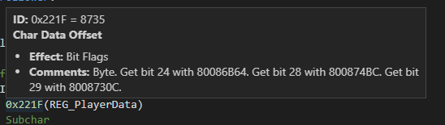
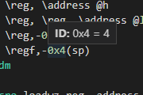
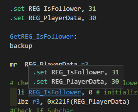

# PowerPC Syntax - What's new?

### [1.1.0] - 2/5/2021
- "Go To Definition" support (or `ctrl+click`) for **Labels, Variables, and Macros***
- Ability to go to file through "Go To Definition" (or `ctrl+click`)
- Hover over PowerPC commands to see a description of their use.
- Hover over Hex codes and see their resolved numbers.
    - Also, if the hex happens to be a SSBM Global Address or Character Data Offset, relevant data will appear.

# [1.0.2] - 2/4/2021
- Updated `storage.modifier.ppc.assembly` to account for spaces or tabs at the start of the string

# [1.0.0] - 2/3/2021
- Initial release
